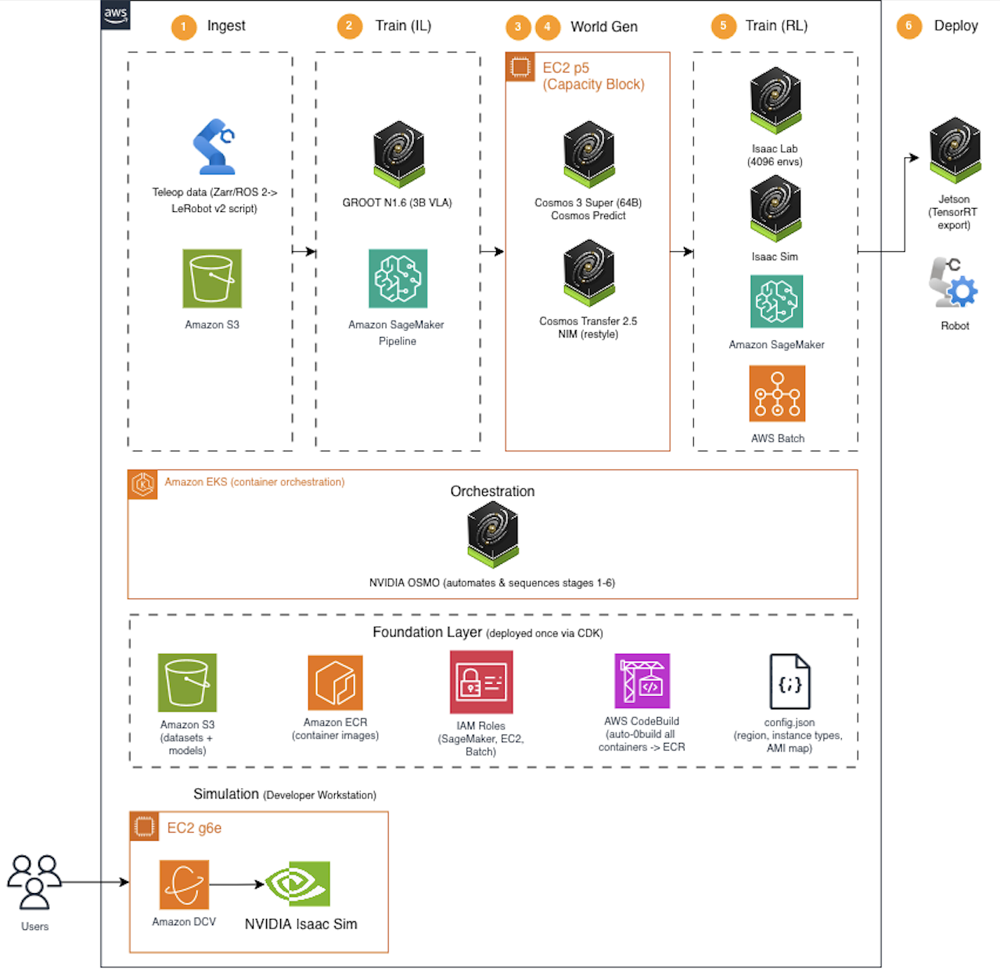

# AWS Physical AI Toolkit

A generalized framework for training and deploying robot policies on AWS — any robot, any task, any hardware. Provides the core infrastructure pipeline (data ingestion, model training, synthetic data generation, RL refinement, export) using open-source tools (GR00T, Isaac Sim, Isaac Lab, Cosmos, LeRobot, Hugging Face, ROS 2, PyTorch) on AWS services.

The toolkit is **robot-agnostic and task-agnostic**. Bring your own URDF, your own teleoperation data, and your own task definition — the pipeline handles the rest. We include a complete **pick-and-place example** (UR3 arm + Robotiq gripper) so you can see the full system working end-to-end before adapting it to your own use case.

---

---

## What You'll Build

```
Teleop Data      Imitation Learning      World Generation      Data Augmentation     RL Training         Export .onnx
                 (GR00T on               (Cosmos Predict V2V)  (Cosmos Transfer)     (Isaac Lab on       (ready for
                  SageMaker)                                                          SageMaker)          deployment)
```

A Physical AI pipeline with:

- **Infrastructure as Code** — everything deploys via `cdk deploy`. Reproducible, versionable, teardown-able.
- **Open-source toolchain** — GR00T, Isaac Sim, Isaac Lab, Cosmos, LeRobot, Hugging Face, ROS 2, PyTorch
- **AWS services** — SageMaker (training), S3 (data), ECR (containers), CodeBuild (CI), EC2 (Cosmos generation)
- **GPU-accelerated** — NVIDIA GPUs for parallel simulation (4096 robots simultaneously) and photorealistic world generation (Cosmos 3 on H100)

---

## Labs

| # | Lab | What You Build | Time |
|---|-----|---------------|------|
| 0 | [Prerequisites](workshop/lab-0-prerequisites.md) | Deploy AWS infrastructure | 30 min |
| 1 | [Train from Demos](workshop/lab-1-train-groot.md) | GR00T fine-tuning on SageMaker (+ optional physical-UR3 record & control) | 2 hrs |
| 2 | [Isaac Sim Workstation](workshop/lab-2-isaac-workstation.md) | GPU remote desktop for visual dev | 30 min |
| 3 | [Cosmos World Generation](workshop/lab-3-cosmos-world-generation.md) | Generate synthetic demos (Cosmos 3 Super, Predict) | 1-2 hrs |
| 4 | [Cosmos Transfer](workshop/lab-4-cosmos-transfer.md) | Restyle existing data preserving actions (Transfer 2.5) | 1-2 hrs |
| 5 | [RL Policy Training](workshop/lab-5-rl-refinement-with-isaac.md) | Isaac Lab RL policy training in simulation | 3 hrs |
| 6 | [OSMO Orchestration](workshop/lab-6-osmo-orchestration.md) | Production pipeline on EKS (placeholder) | 2-3 hrs |

**No robot hardware required.** Labs 0-6 run entirely in the cloud on the bundled demonstrations. Lab 1 also includes an optional bring-your-own-robot track — teams with a physical UR3 can record their own demonstrations and run the trained policy on the arm, completing the full teleop → train → deploy → autonomous-control loop.

→ **New to Physical AI?** Read the [Workshop Introduction](workshop/README.md) for background on how robots learn, key terminology, and what each lab teaches.

---

## Not Just a Toolkit — Also a Workshop

This repo is both an **accelerator framework** and a **hands-on learning experience**. Each lab includes:

- Step-by-step instructions with exact CLI commands and expected outputs
- Cost and time estimates so you know what you're spending before you run anything
- "Under the hood" sections that explain what each command does and why
- Troubleshooting tables for common issues

While some AWS cloud experience is assumed, no prior robotics experience is required. The [workshop introduction](workshop/README.md) covers foundational concepts — how robots learn from demonstrations vs. simulation, what a policy is, why sim-to-real transfer is hard, and a full terminology glossary.

The workshop format is modular: run all labs in a day as an instructor-led session, work through them self-paced over a week, or jump directly to the lab that matches your immediate need.

---

## Modular by Design

This is a **modular framework** — use the pieces you need. Each lab is an independent building block: imitation learning (Lab 1), simulation (Labs 2, 5), synthetic data generation (Labs 3, 4), and orchestration (Lab 6) can be adopted individually or combined. The infrastructure (Lab 0) provides the shared foundation that all other labs build on.

---

## Pick and Place Example Use Case Included

The toolkit is generic infrastructure for any robot, any task, any hardware. To demonstrate it working end-to-end, we provide a complete **pick-and-place** example — the most common industrial robot task (bin picking, kitting, palletizing).

The example uses a **UR3 arm** (a popular collaborative robot in the industry) with its standard **Robotiq 2F-85 gripper** and includes 27 real teleoperation episodes. You can swap in any robot by providing your own URDF and teleop data — the pipeline (CDK infra, SageMaker training, Cosmos generation, Isaac Lab RL) stays the same regardless of embodiment or task.

---

---

## Architecture



**Stages:**
1. **Ingest** — Convert teleoperation recordings (Zarr, ROS bags, CSV) to LeRobot v2 format and store in S3
2. **Train (Imitation Learning)** — Fine-tune GR00T on your demonstrations via SageMaker Pipeline
3. **World Generation** — Generate new synthetic demonstrations with Cosmos 3 Predict, or restyle existing video with Cosmos Transfer 2.5 preserving actions
4. **Train (Reinforcement Learning)** — Train a policy from scratch in Isaac Lab with domain randomization (4096 parallel environments on one GPU)
5. **Deploy** — Export to TensorRT, deploy to robot fleet via Greengrass

**OSMO** wraps all stages into an automated, repeatable pipeline on EKS — scheduling GPU workloads, sequencing stages, and gating on quality metrics.

**Foundation** provides the shared infrastructure (S3, ECR, IAM, CodeBuild) that all stages build on, deployed once via CDK.

> This is the high-level abstracted architecture. Each lab includes a detailed architecture
> diagram with specific instance types, API endpoints, and data flow for its stage.

---

## What's In This Repo

```
├── config.json              # Region, instance types, AMI mappings
├── cdk/                     # Infrastructure as Code (CDK stacks)
├── containers/              # Dockerfiles + buildspecs (CodeBuild → ECR)
├── training/                # Training scripts, dataset, RL environments
│   ├── groot/               # GR00T pipeline (convert, upload, launch, deploy)
│   ├── scripts/             # Cosmos, RL, evaluation scripts
│   ├── data/                # Teleop dataset (Git LFS) + Cosmos samples
│   └── envs/                # Isaac Lab RL environments
├── pai/                     # The `pai` CLI tool (commands for all labs)
├── scripts/                 # Automation (cosmos3-launch.sh, mirror scripts)
├── kubernetes/              # EKS manifests (production path)
├── docs/                    # Glossary, runbooks, prompt catalog
├── tests/                   # Unit + integration tests
├── workshop/                # Lab guides (README + 7 lab .md files)
├── edge/                    # Greengrass + ROS2 (future)
└── workflows/               # OSMO workflow YAML (future)
```

---

## Quick Start

```bash
git clone <REPO_URL> && cd aws-physical-ai-toolchain

python3 -m venv .venv && source .venv/bin/activate
pip install -e .                                        # installs the `pai` CLI

pai config set aws.region us-west-2
pai doctor                                              # verify credentials + region
pai deploy foundation                                   # S3 + ECR + roles + CodeBuild (~10 min)

git lfs pull && unzip training/data/ur3_episodes_001_027.zip -d training/data/episodes

pai groot convert                                       # Zarr teleop → LeRobot v2
pai groot upload                                        # sync dataset to S3
pai groot launch --max-steps 100                        # smoke-test fine-tuning (~15 min, ~$2)
```

Prerequisites: AWS CLI v2, Node.js 18+, git-lfs. No Docker needed — containers build in CodeBuild.

> **Why CodeBuild?** The NVIDIA base images (Isaac Lab ~16 GB, Cosmos ~30 GB) are too large
> to pull or build locally, and several are x86-only (won't build on Apple Silicon). CodeBuild
> builds them in the cloud and pushes to your ECR automatically on `cdk deploy`.

---

## Estimated Costs

| Component | Cost | Notes |
|-----------|------|-------|
| Lab 1 (GR00T training) | ~$15-30 | ml.g5.12xlarge for 1-2 hours |
| Lab 2 (Workstation) | ~$3/hr | Stop when not in use |
| Lab 3 (Cosmos Predict) | ~$37/hr | p5.48xlarge (Capacity Block, duration varies) |
| Lab 4 (Cosmos Transfer) | ~$37/hr | p5.48xlarge Capacity Block |
| Lab 5 (RL training) | ~$10-30 | ml.g5.xlarge for 2-4 hours |
| **Total (Labs 0-5)** | **~$50-150** | Excluding Cosmos GPU blocks |

All resources tear down with `cdk destroy`.

---

## What's Working

- ✅ Foundation infrastructure (S3, ECR, IAM, CodeBuild)
- ✅ GR00T fine-tuning on SageMaker (27 real UR3 teleop episodes)
- ✅ Isaac Lab RL training (4096 parallel envs, 60K steps/s)
- ✅ Isaac Sim workstation (g6e.4xlarge, DCV + Isaac Sim pre-baked)
- ✅ Cosmos 3 Super V2V generation (synthetic demos from prompts, ~5 min/video)
- ✅ Cosmos Transfer 2.5 NIM (geometry-preserving restyle, quality tuning needed)
- ✅ Real UR3 teleop data (27 episodes, LeRobot v2 format)
- ✅ `pai` CLI for all operations (doctor, deploy, groot, rl, workstation)
- 🔲 OSMO orchestration (Lab 6 — placeholder, contributions welcome)

---

## Who This Is For

- **Robotics engineers** building manipulation or locomotion policies
- **ML engineers** moving from cloud training to physical deployment
- **Solutions architects** designing Physical AI platforms for customers
- **Anyone curious** about how robots learn from human demonstrations and simulation

**Prerequisites:** Familiarity with AWS (CLI, console), Python, and basic ML concepts. No robotics experience required — the [workshop introduction](workshop/README.md) explains the domain concepts as you go.

---

## Contributing

See [CONTRIBUTING.md](CONTRIBUTING.md) for setup and development notes.

## License

Apache 2.0
