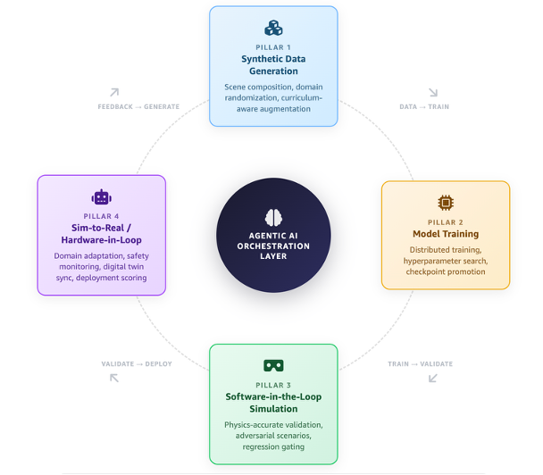

# AWS Physical AI Toolchain

A curated collection of reference architectures, Infrastructure as Code, and deployment automation for running the Physical AI stack on Amazon Web Services.

Physical AI systems — humanoid robots, autonomous mobile robots, self-driving vehicles, and smart factories — are moving from research demonstrations to production deployments. Developing these systems requires three classes of compute working in concert:

1. **High-bandwidth GPU clusters** for foundation model pre-training and post-training (fine-tuning, alignment)
2. **Elastic mid-tier GPU capacity** for simulation and software-in-the-loop validation
3. **Edge GPUs** ([NVIDIA Jetson Thor / AGX](https://developer.nvidia.com/embedded-computing)) inside the robot or at the edge for real-time inference

This toolchain provides AWS sample code for each stage, built on AWS managed services and integrated with the NVIDIA Physical AI software ecosystem.

## Physical AI Development Flywheel

Physical AI development follows a continuous improvement cycle. Each stage feeds the next, accelerating model quality with every iteration:

  

The flywheel consists of four pillars with an **Agentic AI Orchestration Layer** at the center:

| Pillar 1 | Pillar 2 | Pillar 3 | Pillar 4 |
|----------|----------|----------|----------|
| **Synthetic Data Generation** | **Model Training** | **SIL Simulation** | **Sim-to-Real / HIL** |
| Scene composition, domain randomization, curriculum-aware augmentation | Distributed training, RL, hyperparameter search, checkpoint promotion | Physics-accurate validation, adversarial scenarios, regression gating | Domain adaptation, safety monitoring, digital twin sync, deployment scoring |
| *[Isaac Sim](https://docs.isaacsim.omniverse.nvidia.com/latest/index.html) + [Cosmos](https://www.nvidia.com/en-us/ai/cosmos/)* | *[GR00T](https://developer.nvidia.com/isaac/gr00t), [DreamZero](https://github.com/dreamzero0/dreamzero), [Isaac Lab](https://isaac-sim.github.io/IsaacLab/main/index.html)* | *[Isaac Sim](https://docs.isaacsim.omniverse.nvidia.com/latest/index.html)* | *[Jetson](https://developer.nvidia.com/embedded-computing) / RTX* |

**Data → Train → Validate → Deploy → Feedback → Generate** — a closed loop of continuous model improvement.

**Orchestration** spans the entire cycle — [NVIDIA OSMO](https://nvidia.github.io/OSMO/main/user_guide/index.html) coordinates task scheduling, data flow, dependency resolution, and resource allocation across heterogeneous compute. At the agentic layer, [**Strands Agents**](strands-agents-on-aws/) drive robots in natural language and close the loop — turning a trained policy into robot behavior, then deciding what to generate or train next.

---

## Toolchain Components

| Component | Description | Deploy (Terraform) | Get Started | Status |
|-----------|-------------|-------------------|-------------|--------|
| [**Foundation**](foundation/) | Shared S3 buckets, ECR repos, IAM roles, VPC, SSM parameters | `foundation/infra/` | [README](foundation/) | Available |
| [**Cosmos**](cosmos-on-aws/) | [NVIDIA Cosmos](https://www.nvidia.com/en-us/ai/cosmos/) world generation (Predict V2V) + data augmentation (Transfer 2.5) | `cosmos-on-aws/infra/` | [README](cosmos-on-aws/) | Available |
| [**Isaac Lab**](isaac-lab-on-aws/) | [NVIDIA Isaac Lab](https://developer.nvidia.com/isaac/lab) RL training (4096 parallel envs) on SageMaker + Batch | `isaac-lab-on-aws/infra/` | [README](isaac-lab-on-aws/) | Available |
| [**Isaac GR00T**](isaac-gr00t-on-aws/) | Fine-tune [NVIDIA GR00T](https://developer.nvidia.com/isaac/gr00t) N1.6 VLA model on SageMaker + Batch | `isaac-gr00t-on-aws/infra/` | [README](isaac-gr00t-on-aws/) | Available |
| [**DreamZero**](dreamzero-on-aws/) | Fine-tune [NVIDIA DreamZero](https://github.com/dreamzero0/dreamzero), a 14B World Action Model, with LoRA on SageMaker; automatic merge to servable weights | CDK — [standalone repo](https://github.com/aws-samples/sample-dreamzero-finetuning-on-sagemaker) | [README](dreamzero-on-aws/) | Available |
| [**Isaac Sim**](isaac-sim-on-aws/) | [NVIDIA Isaac Sim](https://docs.isaacsim.omniverse.nvidia.com/latest/index.html) GPU workstation for physics simulation | `isaac-sim-on-aws/infra/` | [README](isaac-sim-on-aws/) | Available |
| [**OSMO**](osmo-on-aws/) | [NVIDIA OSMO](https://nvidia.github.io/OSMO/main/user_guide/index.html) 6.3 orchestration on EKS - control plane, compute, GPU scheduling | `osmo-on-aws/001-iac/` | [README](osmo-on-aws/) | Available |
| *Edge Deployment* | Model packaging to [Jetson](https://developer.nvidia.com/embedded-computing) via EKS Hybrid Nodes + Greengrass | Planned | - | Planned |
| [**Strands Agents**](strands-agents-on-aws/) | Natural-language robot orchestration with [Strands Agents](https://strandsagents.com) SDK + [strands-robots](https://github.com/strands-labs/robots) (MuJoCo sim by default, real hardware opt-in); Amazon Bedrock AgentCore hosted runtime planned | (control plane) | [README](strands-agents-on-aws/) | Available |
| *Model Evaluation* | Benchmarking, regression testing, and safety validation pipelines | Planned | - | Planned |

---

## Architecture

**Pipeline stages:**
1. **Ingest** — Convert teleoperation recordings (Zarr, ROS bags, CSV) to LeRobot v2 format and store in S3
2. **Train (Imitation Learning)** — Fine-tune GR00T on demonstrations via SageMaker
3. **World Generation** — Generate new synthetic demos with Cosmos 3 Predict, or restyle existing video with Cosmos Transfer 2.5
4. **Train (Reinforcement Learning)** — Train a policy from scratch in Isaac Lab (4096 parallel environments on one GPU)
5. **Deploy** — Export to TensorRT, deploy to robot fleet via Greengrass

---

## How It Maps to AWS

| Flywheel Stage | AWS Compute | Supporting Services |
|----------------|-------------|---------------------|
| **Synthetic Data Generation** | Amazon EC2 (G6e / L40S, P5 / H100) on EKS | Amazon S3, Amazon ECR, [NVIDIA NGC](https://catalog.ngc.nvidia.com/) |
| **Model Training** | Amazon SageMaker, AWS Batch (P5 / P6 with EFA) | Amazon S3, Amazon FSx for Lustre |
| **SIL Simulation** | Amazon EC2 (G6e GPUs) on EKS | Amazon S3, Amazon CloudWatch |
| **HIL / Edge Deployment** | EKS Hybrid Nodes (Jetson, RTX workstations) | AWS Site-to-Site VPN, AWS Direct Connect |
| **Orchestration (OSMO)** | Amazon EKS (system nodes) | Amazon RDS, ElastiCache, S3, Secrets Manager, KMS |

---

## When to Use OSMO vs. Individual Tools

This toolchain supports two usage patterns depending on where you are in your Physical AI journey:

**Use OSMO (full orchestration)** when you need an end-to-end platform that manages the entire flywheel — scheduling tasks across heterogeneous compute, resolving data dependencies between stages, and routing workloads from cloud GPUs to edge devices. OSMO is the right choice when:
- You are building a new Physical AI pipeline from scratch
- You need a single control plane to coordinate SDG, training, simulation, and deployment
- You want declarative YAML-driven workflows with automatic dependency resolution
- You need multi-cluster orchestration (cloud + on-premises lab + edge)

**Use individual tools standalone** when you already have an established orchestration pipeline (e.g., Kubeflow, Airflow, Argo Workflows, or a custom CI/CD system) and want to integrate a specific NVIDIA capability into your existing infrastructure:

| Scenario | Recommended Approach |
|----------|---------------------|
| Greenfield Physical AI platform | Start with **osmo-on-aws** — it provides orchestration + compute for all stages |
| Existing pipeline, need RL training | Deploy **isaac-lab-on-aws**, submit jobs via SageMaker or Batch |
| Existing pipeline, need imitation learning | Deploy **isaac-gr00t-on-aws**, fine-tune GR00T on your data |
| Existing pipeline, need SDG only | Deploy **cosmos-on-aws** as a standalone service |
| Existing pipeline, need edge deployment | Use **jetson-edge-deployment** to package and push models |
| Migrating from scripts to managed orchestration | Start with **osmo-on-aws**, then migrate stages incrementally |

---

## Pick and Place Example Use Case Included

The toolkit is generic infrastructure for any robot, any task, any hardware. To demonstrate it working end-to-end, we provide a complete **pick-and-place** example — the most common industrial robot task (bin picking, kitting, palletizing).

The example uses a **UR3 arm** (a popular collaborative robot in the industry) with its standard **Robotiq 2F-85 gripper** and includes 27 real teleoperation episodes. You can swap in any robot by providing your own URDF and teleop data — the pipeline stays the same regardless of embodiment or task.

---

## Estimated Costs

| Component | Cost | Notes |
|-----------|------|-------|
| GR00T training (smoke test) | ~$2 | ml.g5.12xlarge for 15 min |
| GR00T training (full) | ~$79 | ml.g5.12xlarge for 11 hrs |
| DreamZero fine-tune (smoke gate) | ~$10 | ml.g7e.24xlarge for 25 min |
| DreamZero fine-tune (1000 steps) | ~$93 | ml.g7e.24xlarge for 4 h 11 m |
| Cosmos 3 Predict | ~$37/hr | p5.48xlarge (Capacity Block) |
| Cosmos Transfer 2.5 | ~$8/hr | g6e.12xlarge (Spot) |
| Isaac Sim workstation | ~$1.86/hr | g6e.4xlarge (stop when idle) |
| Isaac Lab RL training | ~$10-30 | ml.g5.xlarge for 2-4 hrs |
| OSMO (full deployment) | ~$5/hr | EKS + RDS + ElastiCache |

All resources tear down with `terraform destroy` or `aws cloudformation delete-stack`.

---

## Prerequisites

- AWS account with GPU quota (SageMaker + EC2)
- AWS CLI v2, Python 3.11+
- NVIDIA NGC API key (for container image pulls) — [generate here](https://ngc.nvidia.com/setup/api-key)
- HuggingFace token (for model weight downloads) — [create here](https://huggingface.co/settings/tokens)
- **Production path:** Terraform >= 1.5
- **Workshop path:** No Terraform needed
- No Docker required locally — containers build in AWS CodeBuild

---

## Who This Is For

- **Robotics engineers** building manipulation or locomotion policies
- **ML engineers** moving from cloud training to physical deployment
- **Solutions architects** designing Physical AI platforms for customers
- **Platform teams** deploying NVIDIA tools on AWS infrastructure
- **Anyone curious** about how robots learn from demonstrations and simulation

---

## Contributing

See [CONTRIBUTING.md](CONTRIBUTING.md) for setup and development notes.

## License

Apache 2.0 — see [LICENSE](LICENSE).

## Authors
- **Abhishek Srivastav** — Principal Solutions Architect, AWS
- **Steven DeVries** - Principal Solutions Architect, AWS
- **Ignacio Salvar** — Solutions Architect, AWS
- **Adam Weber** — Senior Solutions Architect, AWS
- **Gopi Krishnamurthy** - Senior Solutions Architect, AWS

