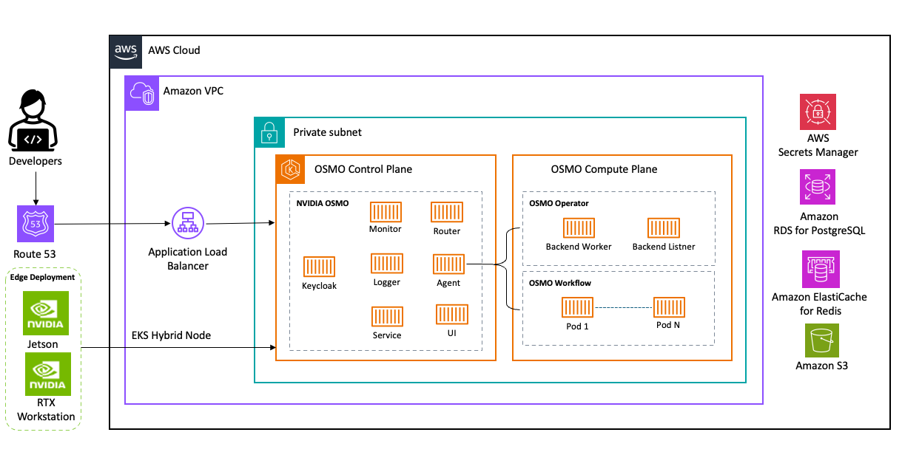

<h1 align="center">NVIDIA OSMO on AWS</h1>

<p align="center">
  <a href="https://www.apache.org/licenses/LICENSE-2.0"></a>
  
  
  
  
</p>

<p align="center">
  End-to-end deployment infrastructure for <a href="https://developer.nvidia.com/osmo">NVIDIA OSMO</a> 6.3 — an open-source, cloud-native workflow orchestration platform for physical AI and robotics (synthetic data generation, model training, simulation, and hardware-in-the-loop testing across heterogeneous compute) — on Amazon Web Services (EKS), with Keycloak as the identity provider.
</p>

---

## Table of Contents

- [Overview](#overview)
- [Architecture](#architecture)
- [Quick Start](#quick-start)
- [Install OSMO CLI](#install-osmo-cli)
- [Example Workflows](#example-workflows)
- [Directory Structure](#directory-structure)
- [Deployment Modes](#deployment-modes)
- [Configuration](#configuration)
- [State Management](#state-management)
- [Post-Deploy: Admin User Bootstrap](#post-deploy-admin-user-bootstrap)
- [Authentication Architecture](#authentication-architecture)
- [Security](#security)
- [Development](#development)
- [Cleanup](#cleanup)
- [Troubleshooting](#troubleshooting)
- [Features and Observability](#features-and-observability)

---

## Overview

This repository provides Infrastructure as Code (Terraform) and deployment scripts for running OSMO on AWS EKS with managed services for PostgreSQL (RDS), Redis (ElastiCache), and object storage (S3).

## Architecture

<p align="center">
  
</p>

## Quick Start

### Prerequisites

**1. Install the required tools:**

```bash
cd 000-prerequisites
./install-tools.sh        # Install AWS CLI, kubectl, helm, terraform, yq
```

**Required tools:** `aws`, `kubectl`, `helm`, `terraform`, `jq`, `yq`, `openssl`

**2. Configure AWS credentials:**

> The remaining scripts and Terraform authenticate with your local AWS credentials. Set them up by following [Setting up the AWS CLI](https://docs.aws.amazon.com/cli/latest/userguide/getting-started-quickstart.html), using the authentication method appropriate for your organization (AWS recommends short-lived credentials over long-lived access keys). Verify access with `aws sts get-caller-identity`, and pass `--profile <name>` to the scripts where supported.

**3. Initialize the environment and finish setup** (still in `000-prerequisites/`):

```bash
./aws-env-init.sh         # Verify credentials, export AWS region
./verify-prerequisites.sh # Verify setup
```

### Deploy Infrastructure

**1. Create your `terraform.tfvars` from a preset:**

```bash
cd 001-iac
cp terraform.tfvars.dev.example terraform.tfvars    # or terraform.tfvars.prod.example
```

**2. Set the mandatory variables** — these have **no default**, so `terraform apply` fails without them:

```hcl
aws_region        = "us-west-2"                # Region to deploy into
cluster_name      = "osmo"                      # EKS cluster name
resource_suffix   = "osm01"                     # Unique per deployment (see note below)
route53_zone_id   = "Z0123456789ABCDEFGHIJ"     # ID of an EXISTING Route53 hosted zone you control
route53_zone_name = "example.com"               # Name of that zone; OSMO hostnames are created under it
gpu_ami_id        = "ami-0d10cbd3200341288"     # Ubuntu EKS AMI for your region + k8s version (see note below)
```

> **`resource_suffix` must match `aws.resource_suffix` in `002-setup/config/deployment-config.yaml`** (set in the next section). It must also be unique per deployment, or resources collide across environments.

> **`gpu_ami_id` is required.** Use the Canonical **Ubuntu EKS** image for your region and Kubernetes version, looked up at <https://cloud-images.ubuntu.com/docs/aws/eks/> (AMI IDs are region- and version-specific and change over time). `control-plane-only` deployments create no GPU nodes, but the variable is still required — any valid AMI ID works there.

**3. Set the ALB access allow-list** — technically optional, but skip it and the UI/API are unreachable:

```hcl
# Every public CIDR you will connect from — browser AND CLI:
alb_allowed_cidrs = ["203.0.113.10/32", "198.51.100.0/24"]
```

> If left empty (`[]`), the AWS Load Balancer Controller manages its own security group open to `0.0.0.0/0`. Manage these CIDRs **only here** — adding them by hand in the EC2 console causes an `InvalidPermission.Duplicate` error on the next `terraform apply`. If traffic is refused while every pod is healthy, this list is the usual cause.

**4. (Optional) Configure a remote state backend** — recommended for teams:

```bash
cp backend.tf.example backend.tf              # S3 backend
# or: cp backend.tf.gitlab-example backend.tf # GitLab backend
# then edit backend.tf with your values — see "State Management" below
```

**5. Deploy:**

```bash
terraform init
terraform apply
```

**Apply order and parallelism:** Terraform creates the **platform** module first (VPC, RDS, Redis, S3, KMS, ACM certificates, etc.); within that phase it runs as many resources in parallel as the dependency graph allows (subject to `-parallelism`, default 10). The **EKS** module (cluster and node groups) starts only after the entire platform has finished, so you will see RDS and other platform resources creating before the cluster. To speed up the platform phase you can run `terraform apply -parallelism=20`. To allow the cluster to be created in parallel with RDS/Redis, the platform would need to be split so EKS depends only on a smaller "foundation" (VPC, KMS, S3, Secrets ARNs); see the comment in `001-iac/main.tf` above the EKS module.

### Configure Central Config

The deploy scripts (`01`–`05`) read `002-setup/config/deployment-config.yaml` for **versions, dependencies, namespaces, and feature flags**. Region, cluster name, `resource_suffix`, hostnames, and the **Keycloak admin username** are **not** set here — those come from `001-iac/terraform.tfvars` and reach the scripts via Terraform outputs.

**1. Copy the example:**

```bash
cd 002-setup
cp config/deployment-config.yaml.example config/deployment-config.yaml
```

**2. Usually nothing to edit** — `osmo`/`dependencies` versions, `helm_repos`, `namespaces`, `timeouts`, and `features` ship with working defaults; change them only if you need to.

> **Hostnames, region, `resource_suffix`, and the Keycloak admin username are not set here** — they come from `001-iac/terraform.tfvars` via Terraform outputs (the admin user is the `keycloak_admin_username` variable, default `admin`). The OSMO hostname is composed in `001-iac/locals.tf` as `osmo-aws.<route53_zone_name>` / `osmo-aws-auth.<route53_zone_name>`; to change any of these, edit `terraform.tfvars` (or `locals.tf`) and re-apply Terraform.

### Deploy OSMO

All deployment scripts read Terraform outputs automatically, so no manual copy-paste of IDs or ARNs is required. Run them from the `002-setup/` directory.

```bash
cd 002-setup
```

**Step 1: AWS Prerequisites** (ALB Controller, External Secrets Operator, ClusterSecretStore):

```bash
./01-deploy-aws-prerequisites.sh
```

**Step 2: GPU Infrastructure** (NVIDIA GPU Operator, KAI Scheduler):

```bash
./02-deploy-gpu-infrastructure.sh
```

**Step 3: Keycloak** (identity provider that deploys Keycloak, creates realm, clients, admin user):

```bash
./03-deploy-keycloak.sh --admin-password 'YourSecurePassword!'
```

This creates the `keycloak` database in RDS, installs Keycloak via Helm, configures the `osmo` realm with `osmo-browser-flow` and `osmo-device` clients, and stores the OAuth2 client secret for OSMO. See the [OSMO Keycloak setup guide](https://nvidia.github.io/OSMO/release/6.3/deployment_guide/appendix/keycloak_setup.html) for details.

**Step 4: OSMO Control Plane** (single consolidated `service` chart for API + Router + UI + gateway). This step also applies the declarative ConfigMap configuration (pools, `l40s` platform, pod templates, roles, backend scheduler, dataset/workflow storage) from `values/osmo-control-plane.yaml` plus a generated overlay:

```bash
./04-deploy-osmo-control-plane.sh
```

> If the OSMO images require NGC authentication (private `nvcr.io`), pass `--ngc-api-key "<key>"` (or set `NGC_API_KEY`) and the script creates an `ngc-registry-secret` pull secret. Skip it if a pull secret already exists or the images are public.

After this step completes, verify you can log in at `https://<osmo_hostname>`. You will be redirected to Keycloak for authentication.

Re-running with `--skip-secrets --skip-mek` skips secret and MEK generation (useful when updating configuration without rotating secrets).

**Step 5: Backend Operator** (Workload execution infrastructure):

```bash
./05-deploy-osmo-backend.sh
```

This script bootstraps the admin user in OSMO's database, creates a backend service token, and deploys the backend operator. It connects directly to the OSMO service (bypassing Envoy) so no IdP credentials are needed.

**Step 5b: Assign Admin Roles** (one-time manual step):

After deploying the backend operator, assign the `osmo-admin` role to your Keycloak admin user so they can access the OSMO UI and CLI. This is a one-time bootstrap step. See [Post-Deploy: Admin User Bootstrap](#post-deploy-admin-user-bootstrap) below for detailed instructions.

### Install OSMO CLI

Once the OSMO platform is deployed and your admin user has roles assigned, install the OSMO CLI to interact with your cluster from the command line.

**Install the latest version:**

```bash
curl -fsSL https://raw.githubusercontent.com/NVIDIA/OSMO/refs/heads/main/install.sh | bash
```

**Install a specific version:**

Visit the [OSMO GitHub Releases](https://github.com/NVIDIA/osmo/releases) page, navigate to the Assets section for the desired release, and download the appropriate package for your OS and CPU architecture.

**Log in to your OSMO instance:**

```bash
osmo login https://<your-osmo-hostname>/
```

This initiates the OAuth2 Device Authorization flow (RFC 8628) using the `osmo-device` Keycloak client. Follow the on-screen instructions to complete authentication in your browser.

**Verify the CLI is connected:**

```bash
osmo cluster status
```

**Uninstall (if needed):**

```bash
/usr/local/osmo/uninstall.sh
```

For more details, see the [OSMO Install Client documentation](https://nvidia.github.io/OSMO/release/6.3/user_guide/getting_started/install/index.html).

## Example Workflows

The `003-workflows/` directory contains ready-to-submit example workflows that demonstrate OSMO capabilities on this AWS deployment.

### Set Up Your Default Profile

Before submitting workflows, configure your OSMO CLI profile with the default pool and bucket for this cluster. This ensures workflows are scheduled to the correct compute resources.

**View your current profile:**

```bash
osmo profile list
```

**Set the default pool** (this deployment configures a pool named `default`):

```bash
osmo profile set pool default
```

**Verify accessible pools and resources:**

```bash
osmo resource list
```

For more details on profile configuration, see the [OSMO Setup Profile documentation](https://nvidia.github.io/OSMO/release/6.3/user_guide/getting_started/profile.html).

### Available Examples

| Workflow | GPU | Description |
|----------|:---:|-------------|
| `hello_world.yaml` | No | Minimal smoke test to verify OSMO is working |
| `serial_workflow.yaml` | No | Three-stage pipeline with data passing between tasks |
| `gpu_test.yaml` | 1× L40S | Validates GPU availability and CUDA functionality |
| `parallel_workflow.yaml` | 2× L40S | Grouped tasks communicating over the network |
| `combined_workflow.yaml` | L40S | Serial execution between groups + parallel within groups |
| `test_bucket_write.yaml` | 1× L40S | Writes a file to S3 via OSMO's IRSA-backed output mechanism |
| `isaacsim_livestream.yaml` | 1 GPU | Launches Isaac Sim with headless livestreaming |
| `cosmos_transfer.yaml` | L40S | Full Isaac Sim → Cosmos Transfer2.5 SDG pipeline |
| `cosmos_transfer_augmentation.yaml` | L40S | Prompt-driven video augmentation with Cosmos Transfer2.5 |
| `pick_and_place_training.yaml` | Multi-GPU | Reference skeleton for a full pick-and-place pipeline |

### Getting Started (Recommended Order)

Start with the simplest workflows and progress to GPU and storage tests:

**1. Hello World** — verify OSMO scheduling:

```bash
osmo workflow submit 003-workflows/hello_world.yaml
```

**2. Serial Pipeline** — validate data flow between tasks:

```bash
osmo workflow submit 003-workflows/serial_workflow.yaml
```

**3. GPU Test** — confirm GPU nodes are healthy:

```bash
osmo workflow submit 003-workflows/gpu_test.yaml
```

**4. S3 Bucket Write** — verify IRSA and S3 connectivity:

```bash
osmo workflow submit 003-workflows/test_bucket_write.yaml
```

### Monitoring Workflows

```bash
osmo workflow list                    # List all workflows
osmo workflow status <workflow-id>    # Check status of a specific run
osmo workflow logs <workflow-id>      # View task logs
```

## Directory Structure

```
osmo-on-aws/
├── 000-prerequisites/     # Tool installation and AWS setup
├── 001-iac/               # Terraform infrastructure
│   └── modules/
│       ├── platform/      # VPC, RDS, ElastiCache, S3, KMS
│       └── eks/           # EKS cluster, node groups, IRSA
├── 002-setup/             # Deployment scripts
│   ├── lib/               # Common shell functions (read_config, fetch_osmo_chart)
│   ├── values/            # Helm values files (service [API+router+UI], backend-operator)
│   ├── config/            # Central deployment-config.yaml + templates
│   ├── manifests/         # Kubernetes manifests
│   └── cleanup/           # Uninstall scripts
└── docs/                  # Documentation
```

## Deployment Modes

| Mode | Description |
|------|-------------|
| `full` | Complete deployment with control plane and compute |
| `control-plane-only` | Central management cluster without GPU nodes |
| `backend-only` | Compute cluster connecting to external control plane |

See [docs/deployment-modes.md](docs/deployment-modes.md) for details.

## Configuration

### Terraform Variables

Key variables in `terraform.tfvars`:

```hcl
aws_region       = "us-west-2"
cluster_name     = "osmo-cluster"
environment      = "dev"
resource_suffix  = "osm01"   # REQUIRED (no default): unique suffix for resource names; set per deployment to avoid collisions
deployment_mode  = "full"

# Keycloak IdP (self-hosted; deployed by 03-deploy-keycloak.sh)
deploy_keycloak         = true
keycloak_realm          = "osmo"
keycloak_admin_username = "admin"

# Node groups
system_node_instance_types = ["m6i.xlarge"]
gpu_node_instance_types    = ["g5.2xlarge"]

# RDS
rds_instance_class = "db.t3.medium"
rds_multi_az       = false

# Redis
redis_node_type = "cache.t3.medium"
```

Set `resource_suffix` to a unique value (e.g. `osm01`, `dev02`) in `terraform.tfvars`; it has no default and is required. Changing it creates a distinct set of AWS resources and avoids name collisions when reusing the same `cluster_name` and `environment`.

### Example Presets

- `terraform.tfvars.dev.example` - Cost-optimized development
- `terraform.tfvars.prod.example` - Production with HA

## State Management

<details>
<summary><b>Click to expand state management options</b></summary>
<br/>

Terraform stores state about your managed infrastructure and configuration. This state is used by Terraform to map real world resources to your configuration, keep track of metadata, and to improve performance for large infrastructures.

### 1. Local State (Default)

By default, Terraform stores state locally in a file named `terraform.tfstate`. This is suitable for testing and development but **not recommended for production** or team environments.

**Configuration:**
No additional configuration is required. Just run `terraform init`.

### 2. S3 Backend (Recommended for AWS)

Storing state in an S3 bucket with DynamoDB for locking is the standard best practice for AWS deployments.

**Prerequisites:**
You need an S3 bucket and a DynamoDB table. You can create them using the AWS CLI commands provided in the example file.

**Configuration:**
Copy the example file and update the values:

```bash
cp 001-iac/backend.tf.example 001-iac/backend.tf
# Edit backend.tf with your bucket name, region, and DynamoDB table
```

See [`001-iac/backend.tf.example`](001-iac/backend.tf.example) for full details including the commands to create the S3 bucket and DynamoDB lock table.

### 3. GitLab Managed Terraform State

GitLab provides a built-in HTTP backend for Terraform state, eliminating the need for separate S3/DynamoDB infrastructure. This is particularly useful for CI/CD pipelines within GitLab.

**Configuration:**
Copy the example file and update the values:

```bash
cp 001-iac/backend.tf.gitlab-example 001-iac/backend.tf
# Replace <GITLAB_PROJECT_ID> with your numeric project ID
```

Authentication is handled via environment variables:
- **CI/CD pipelines:** GitLab CI auto-injects credentials when using the official Terraform CI template
- **Local development:** Export `TF_HTTP_USERNAME` and `TF_HTTP_PASSWORD` (a personal access token with `api` scope)

See [`001-iac/backend.tf.gitlab-example`](001-iac/backend.tf.gitlab-example) for full details including CI/CD configuration examples.

</details>

## Post-Deploy: Admin User Bootstrap

After running all deployment scripts, you need to assign OSMO roles to your admin user. This is a one-time step that gives the Keycloak admin user access to the OSMO UI and API.

**Why this is needed:** Keycloak provides user identity (authentication), but OSMO manages its own roles and permissions (authorization). The deployment script creates the admin user in OSMO's database during Step 5, but you need to verify it and optionally add more users.

### Quick Bootstrap (automated by Step 5)

Script `05-deploy-osmo-backend.sh` automatically creates user `osmo-admin` with `osmo-admin` and `osmo-backend` roles. After it completes, log in to the OSMO UI and the admin user should have full access.

### Managing Additional Users

To add more users or modify roles, port-forward to the OSMO service and use the REST API:

```bash
# Port-forward directly to OSMO service (bypasses Envoy)
kubectl port-forward -n osmo deploy/osmo-service 8080:8000 &

# Create a new user with roles
curl -s -X POST http://localhost:8080/api/auth/user \
  -H "x-osmo-user: osmo-admin" \
  -H "Content-Type: application/json" \
  -d '{"id": "alice@example.com", "roles": ["osmo-user"]}'

# Add a role to an existing user
curl -s -X POST http://localhost:8080/api/auth/user/alice@example.com/roles \
  -H "x-osmo-user: osmo-admin" \
  -H "Content-Type: application/json" \
  -d '{"role_name": "osmo-admin"}'

# List all users
curl -s http://localhost:8080/api/auth/user \
  -H "x-osmo-user: osmo-admin" | jq .

# List roles for a user
curl -s http://localhost:8080/api/auth/user/osmo-admin/roles \
  -H "x-osmo-user: osmo-admin" | jq .

# Stop port-forward
kill %1
```

### IdP Role Mapping

In 6.3 (ConfigMap mode) the `external_roles` on each OSMO role are declarative Helm values. See `services.configs.roles.*.external_roles` in `values/osmo-control-plane.yaml`, applied by Step 4. The default is a 1:1 mapping (Keycloak group `osmo-admin` → OSMO role `osmo-admin`). To use custom group names, edit the values, e.g.:

```yaml
services:
  configs:
    roles:
      osmo-admin:
        external_roles: [platform-admins]   # IdP group "platform-admins" -> osmo-admin
```

then re-run Step 4 (`./04-deploy-osmo-control-plane.sh`). See [IdP Role Mapping and Sync Modes](https://nvidia.github.io/OSMO/release/6.3/deployment_guide/appendix/authentication/idp_role_mapping.html).

After updating the mapping, create matching groups in Keycloak and assign users:

1. Go to **Keycloak Admin Console** → `osmo` realm → **Groups** → **Create group**
2. Name the group to match the OSMO role (e.g., `osmo-admin`)
3. Add users to the group
4. Assign matching client roles from both `osmo-browser-flow` and `osmo-device` clients

See the [OSMO Keycloak guide: Group and Role Management](https://nvidia.github.io/OSMO/release/6.3/deployment_guide/appendix/keycloak_setup.html#part-3-keycloak-group-and-role-management) for detailed instructions.

## Authentication Architecture

<details>
<summary><b>Click to expand authentication details</b></summary>
<br/>

OSMO 6.3 uses a gateway-based authentication model (Envoy + OAuth2 Proxy in the consolidated `service` chart) with Keycloak as the OIDC provider:

| Flow | Keycloak Client | Grant Type | Token Used |
|------|-----------------|-----------|------------|
| **Browser** | `osmo-browser-flow` (confidential) | Authorization Code | ID token (via `--set-authorization-header`) |
| **CLI** | `osmo-device` (public) | Device Authorization (RFC 8628) | ID token |
| **Service-to-service** | N/A | OSMO-issued service token | OSMO JWT (`iss: osmo`, `aud: osmo`) |

**Request path through each pod:**

1. **Envoy** strips dangerous headers, then runs **ext_authz** → **OAuth2 Proxy** (skipped if Bearer or `x-osmo-auth` already present)
2. **JWT validation**: Envoy's `jwt_authn` filter checks `iss` against the Keycloak issuer (`https://<auth-hostname>/realms/osmo`), validates `aud` against the client ID, and verifies the signature via the JWKS endpoint
3. **RBAC**: the `authz-sidecar` reads group claims and enforces role-based policies

**Key details:**
- Keycloak uses two clients: `osmo-browser-flow` for the web UI and `osmo-device` for the CLI
- The `user_claim` is `preferred_username` (Keycloak default)
- The Envoy `idp` cluster connects to the Keycloak auth hostname for JWKS fetching
- Session cookies use `SameSite=Lax` and a domain scoped to `.osmo_hostname`
- Keycloak supports standard logout via `/protocol/openid-connect/logout`
- CLI device flow (`osmo login --method code`) is fully supported

</details>

## Security

- **IRSA:** All service accounts use IAM Roles for Service Accounts
- **Encryption:** KMS encryption for RDS, ElastiCache, S3, EBS
- **Network:** Private subnets, security groups, VPC endpoints
- **Secrets:** AWS Secrets Manager with KMS encryption
- **Scanning:** Checkov for IaC security scanning, Gitleaks for secret detection

## Development

### Pre-commit Hooks

This repository includes pre-commit hooks for security scanning and code quality:

```bash
# Install pre-commit and hooks
pip install pre-commit
pre-commit install

# Run all checks manually
pre-commit run --all-files

# Run Checkov only
checkov --directory 001-iac --framework terraform
```

### Included Checks

| Tool | Purpose |
|------|---------|
| **Checkov** | Terraform security and compliance scanning |
| **TFLint** | Terraform linting and best practices |
| **ShellCheck** | Shell script static analysis |
| **Gitleaks** | Secret detection in code |
| **terraform fmt** | Terraform formatting |
| **terraform validate** | Terraform configuration validation |

## Cleanup

> For the full, verified teardown procedure — including the ALB/ENI drain wait
> that prevents a stuck `terraform destroy`, and post-destroy manual cleanup —
> see **[docs/TEARDOWN.md](docs/TEARDOWN.md)**. The steps below are a short summary.

```bash
cd 002-setup/cleanup
./uninstall-osmo-backend.sh
./uninstall-osmo-control-plane.sh
# To remove Keycloak:
helm uninstall keycloak -n keycloak
kubectl delete namespace keycloak
./uninstall-aws-prerequisites.sh

cd ../../001-iac
terraform destroy
```

## Environment Variables

| Variable | Used By | Description |
|----------|---------|-------------|
| `NGC_API_KEY` | `04-deploy-osmo-control-plane.sh` | NGC API key for pulling OSMO images (or pass `--ngc-api-key`) |

## Troubleshooting

<details>
<summary><b>Click to expand troubleshooting guide</b></summary>
<br/>

See [docs/troubleshooting.md](docs/troubleshooting.md) for common issues and solutions.

### Common Issues

**"Audiences in Jwt are not allowed"** after login: Three things must align in the gateway JWT config (`gateway.envoy.jwt`):
1. **JWKS URI** must point to the Keycloak certs endpoint (`https://<auth-hostname>/realms/osmo/protocol/openid-connect/certs`)
2. **IDP cluster address** (`gateway.envoy.idp.host`) must be the auth hostname only (`<auth-hostname>`), not the full issuer URL
3. **Audiences** must be set to the actual Keycloak client ID (`osmo-browser-flow` or `osmo-device`)

**Pods in CrashLoopBackOff**: Check logs with `kubectl logs <pod> -n osmo -c <container> --previous`. Common causes:
- `cookie_secret must be 16, 24, or 32 bytes` → the cookie secret was base64-encoded instead of raw bytes
- `ConfigMapReloadFailed` event on the `osmo-service-configs` ConfigMap → a malformed `services.configs.*` value; in ConfigMap mode a bad config crash-loops new pods while healthy pods keep serving. Run `kubectl describe configmap osmo-service-configs -n osmo` and fix the values.
- oauth2-proxy failing to start → in 6.3 it defaults to a Redis session store; ensure `gateway.oauth2Proxy.redis.serviceName` points at ElastiCache (set by Step 4), and if the cache requires AUTH, pass the password via `gateway.oauth2Proxy.extraEnv` (`OAUTH2_PROXY_REDIS_PASSWORD`).

**"Access Denied" in OSMO UI**: The admin user may not have roles assigned in OSMO's database. Follow the [Post-Deploy: Admin User Bootstrap](#post-deploy-admin-user-bootstrap) steps to verify and assign roles.

**Domain shows nothing / ERR_CONNECTION_REFUSED**: Verify ALB is `internet-facing` (check ingress annotations for `alb.ingress.kubernetes.io/scheme: internet-facing`) and that DNS points to the ALB.

</details>

## Features and Observability

<details>
<summary><b>Click to expand the feature list and observability details</b></summary>
<br/>

### Features

- **OSMO 6.3.1** — consolidated `service` chart (API + Router + UI) behind a unified gateway (Envoy + OAuth2 Proxy), configured declaratively via ConfigMap.
- **ConfigMap configuration mode** — pools, platforms, pod templates, roles, backend scheduler, and dataset/workflow config are declarative Helm values (GitOps); the runtime config API is read-only (HTTP 409 on writes).
- **Keycloak identity provider (OIDC)** — browser login, CLI device flow, and group/role management.
- **Three deployment modes** — Full, Control-Plane-Only, Backend-Only (see [Deployment Modes](#deployment-modes)).
- **Central configuration** — a single `deployment-config.yaml` for all environment parameters.
- **High availability** — Multi-AZ deployment for production.
- **Security** — KMS encryption, private subnets, scoped security groups, Keycloak SSO.
- **Scalability** — EKS managed node groups with configurable min/max/desired sizing. (Cluster Autoscaler is not installed by the deploy scripts; add it to auto-scale on pending pods.)
- **GPU support** — NVIDIA GPU Operator + KAI Scheduler on EKS-optimized GPU AMIs.
- **Cost optimization** — Spot-capable GPU node group and adjustable node counts. (Scale-to-zero and automatic scale-up require Cluster Autoscaler.)

### Observability

Logs and metrics integrate with AWS-native services (Grafana is intentionally deferred).

**Logs — Fluent Bit → CloudWatch Logs**
- Terraform (`enable_cloudwatch_logging`, default `true`) provisions a Fluent Bit IRSA role + the `/aws/eks/<cluster>/osmo-logs` log group (`cloudwatch_logs_retention_days`, default 30).
- `01-deploy-aws-prerequisites.sh` deploys the `aws-for-fluent-bit` DaemonSet into `amazon-cloudwatch`.
- OSMO services emit JSON logs (`global.logs.logFormat: json`), queryable in CloudWatch Logs Insights.

**Metrics — Amazon Managed Prometheus (AMP)**
- Terraform (`enable_managed_prometheus`, default `true`) provisions an AMP workspace + an AWS-managed (agentless) scraper. Because the cluster uses **EKS access entries**, AMP auto-grants the scraper cluster access (auto-created access entry + `AmazonPrometheusScraperPolicy`) — no manual access entry or RBAC required.
- The scraper collects kubelet/cAdvisor, annotated pods, and the GPU Operator's **DCGM exporter** (per-GPU utilization/memory/temp/power).
- Private `logs` + `aps-workspaces` VPC interface endpoints keep this traffic off the NAT gateway.
- **Visualization** — query AMP directly, or add Grafana later (Amazon Managed Grafana needs IAM Identity Center/SAML, currently blocked by an org SCP; or run self-hosted Grafana with a SigV4 AMP datasource).

</details>

## License

Apache License 2.0

## Support

- Documentation: [docs/](docs/)
- Issues: Report issues via your internal ticketing system

---

<p align="center">
  Made with ❤️ for Physical AI developers
</p>
